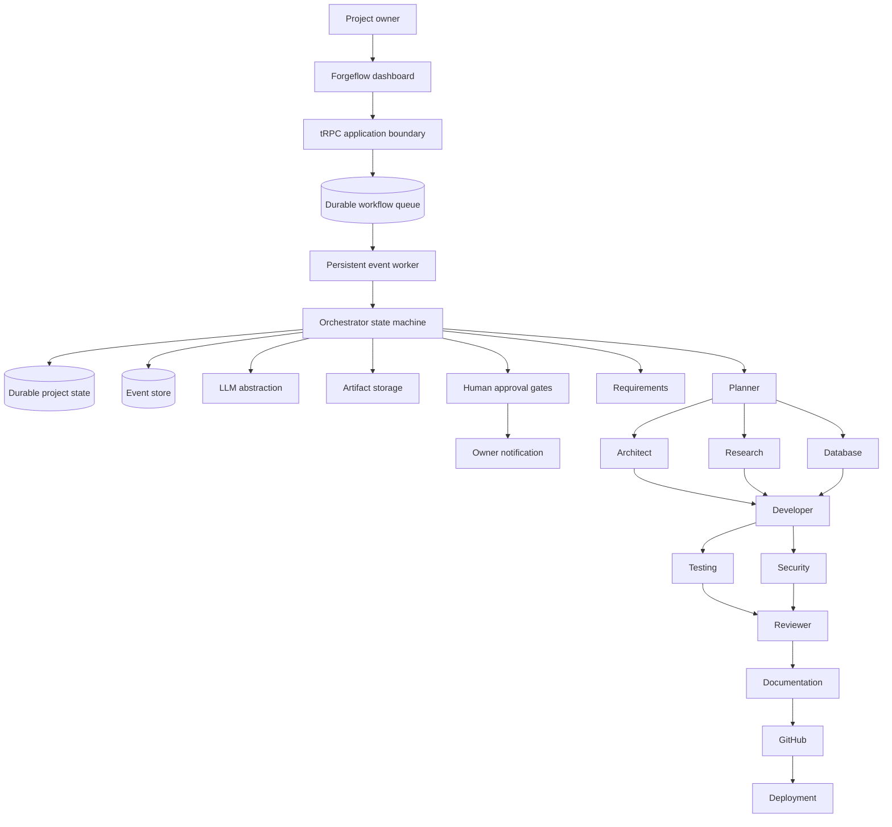

# Forgeflow — Multi-Agent Software Factory

Forgeflow is an AI-powered engineering control plane that turns a natural-language software requirement into a durable, governed development workflow. It is designed to make agentic work inspectable rather than opaque: each agent run, dependency, event, approval decision, output artifact, and retry is persisted in the project state.

## What the platform does

The platform accepts a project brief, extracts a structured software requirements specification, creates a directed workflow graph, and advances ready work in dependency-aware batches. Twelve specialized agents cover requirements, planning, architecture, research, database design, development, testing, security, review, documentation, repository operations, and deployment preparation. The workflow pauses at configured human control points before it can proceed with sensitive actions.

| Capability | Implementation status |
| --- | --- |
| Natural-language intake and structured SRS extraction | Implemented through the server-side LLM abstraction |
| Durable projects, tasks, runs, events, approvals, and artifact metadata | Implemented in the relational data model |
| DAG readiness, concurrent batches, retries, and deadlock detection | Implemented in the orchestration engine |
| Persistent background execution | Implemented with a durable event queue, worker leases, restart recovery, and owner-visible status |
| In-app background failure alerts | Implemented with an owner-scoped inbox, unread indicator, acknowledgment, resolution, and project links |
| Human approval gates and owner notifications | Implemented for architecture, repository, deployment, external-cost, and destructive-migration actions |
| Artifact persistence | Implemented through object storage with durable metadata records |
| Live operations dashboard | Implemented with automatic refresh and project detail views |
| GitHub and third-party deployment execution | Interface and safe preparation stages implemented; credentials and provider-specific adapters remain optional configuration |

## Architecture



## Agent responsibilities

| Agent | Primary output | Workflow dependency |
| --- | --- | --- |
| Requirements | Structured SRS with ambiguities, constraints, assumptions, and acceptance criteria | Start of workflow |
| Planner | Dependency-aware implementation plan | Requirements |
| Architect | Architecture decisions and trade-offs | Planner |
| Research | Research plan and source-aware findings | Planner |
| Database | Data-model, constraints, and migration guidance | Planner |
| Developer | Incremental implementation plan and output artifacts | Architecture, research, and database design |
| Testing | Test strategy and executed-result records when a runner is configured | Developer |
| Security | Risk findings and remediation guidance | Developer |
| Reviewer | Senior engineering review findings | Testing and security |
| Documentation | Implementation-grounded project documentation | Reviewer |
| GitHub | Safe repository and CI workflow plan | Documentation |
| Deployment | Readiness, deployment plan, and rollback preparation | GitHub |

## Approval and safety model

Forgeflow treats generated material and external inputs as untrusted. The orchestrator never treats an LLM response as evidence that an external action occurred. Architecture approval, repository creation, billable external work, destructive database changes, and production deployment are represented as durable approval records. An unresolved gate moves the project to `AWAITING_HUMAN_APPROVAL`; the dashboard and owner notification include the specific action being requested.

Tool permissions are agent-scoped. For example, the Requirements Agent receives artifact storage only, while the Developer Agent receives isolated workspace and test-runner capabilities. The GitHub and deployment tools are intentionally unavailable until a provider adapter is configured.

## Repository layout

```text
client/                 React dashboard and control-room UI
server/factory/         Orchestrator, LLM boundary, agent modules, tool policy, state helpers
server/routers/         Typed application procedures
drizzle/                Relational schema and generated migrations
shared/                 Domain enums, workflow contracts, and validation schemas
docs/                   Architecture, security, operations, and deployment documentation
.github/workflows/      Continuous quality and security workflows
docker-compose.yml      Local development topology
```

## Running locally

Install Node.js 22 and pnpm, then configure a local `DATABASE_URL` in your shell or preferred secret manager and install the repository dependencies.

```bash
corepack enable
pnpm install
pnpm drizzle-kit generate
pnpm dev
```

The platform requires a MySQL-compatible database for its own operational state. In the managed environment, the connection is supplied automatically. For local work, provide a valid `DATABASE_URL` in `.env`, then apply the generated migration SQL using the project migration process.

## Running with Docker Compose

The local compose topology includes an application container and MySQL-compatible state store. It is for development only; it does not create a production deployment or replace approval gates.

```bash
docker compose up --build
```

The application will be available on `http://localhost:3000` after dependency installation completes. Add the OAuth and platform runtime variables required by your target environment before expecting sign-in or built-in services to work locally.

## Environment variables

| Variable | Purpose | Required locally |
| --- | --- | --- |
| `DATABASE_URL` | MySQL-compatible durable state connection | Yes |
| `LLM_PROVIDER` | Logical name for the selected model runtime | No; defaults to the managed runtime |
| `MODEL_NAME` | Preferred default structured-output model | No; defaults to `gpt-5-mini` when available |
| `MANUS_API_KEY` | Optional Manus task runtime credential | Only when enabling the optional remote runtime |
| `MANUS_API_BASE_URL` | Optional Manus API base URL | Only when enabling the optional remote runtime |
| `FORGEFLOW_WORKER_ENABLED` | Enables the persistent event worker when set to `true` | Yes for persistent background execution |

Managed deployments receive the built-in LLM, object storage, owner-notification, authentication, and database configuration through the server environment. Do not place those credential values in source files or commit them to version control.

## Verification

The repository includes Vitest coverage for structured requirements contracts, workflow DAG readiness and deadlock detection, retry budgets, state transitions, approval gates, tool permissions, queue scheduling, worker leases, restart recovery, and background workflow advancement. Run the full local verification suite with:

```bash
pnpm test
pnpm check
pnpm build
```

## Limitations and roadmap

The current application owns the orchestration control plane, a persistent event worker, and a safe local execution model. It does not yet ship a configured GitHub credential, a deployed provider adapter, or a remote Manus task callback endpoint. These are deliberately represented as optional runtime boundaries rather than simulated actions. The next production-oriented extensions are provider adapters with credential management, webhook verification, additional integration testing, and a stronger workspace sandbox.

See [docs/system-design.md](docs/system-design.md), [docs/orchestration.md](docs/orchestration.md), [docs/security.md](docs/security.md), [docs/deployment.md](docs/deployment.md), and [docs/github-handoff.md](docs/github-handoff.md) for further operational detail and repository handoff instructions.
