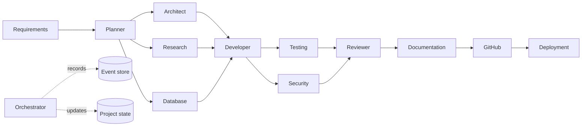

# Multi-Agent Software Factory — System Design

## Design intent

The platform is an auditable control plane for software delivery, not a facade that claims autonomous work occurred. Each agent action is represented by a durable run record, an event, and optional stored artifacts. The server-side orchestrator is the sole component that advances workflow state; agents do not mutate workflow state directly.

## Workflow model

The initial workflow is a directed acyclic graph. Requirements and planning run first. Architecture, research, and database design can proceed after planning. Development waits for all three engineering inputs. Testing and security review may execute concurrently, then converge into review, documentation, repository integration, and an approved deployment workflow.

## Safety and approval model

The system places architecture publication, repository creation, externally billable activity, destructive database changes, and production deployment behind explicit approval records. An approval request sets the project state to `AWAITING_HUMAN_APPROVAL` and includes the exact action in both the dashboard and the notification to the owner. Rejecting an approval does not erase history; it records the decision and pauses the workflow for remediation or closure.

## Runtime boundary

Agents call a local LLM abstraction rather than model-provider SDKs. The abstraction receives the selected model identifier and structured schema, applies provider-safe parameters, records usage when returned, and keeps credentials server-side. The initial hosted implementation uses the preconfigured relational database supplied with the platform for operational state; generated project artifacts remain portable and may target PostgreSQL when that is part of an individual project requirement.

## Reliability model

Each persisted task has dependencies, a run state, attempt count, and retry budget. The orchestrator computes ready tasks using successful prerequisites, detects a state where unfinished tasks cannot become ready, and emits a deadlock event rather than spinning. After restart, it reloads non-terminal projects, marks interrupted runs as retryable, and continues from stored state.
